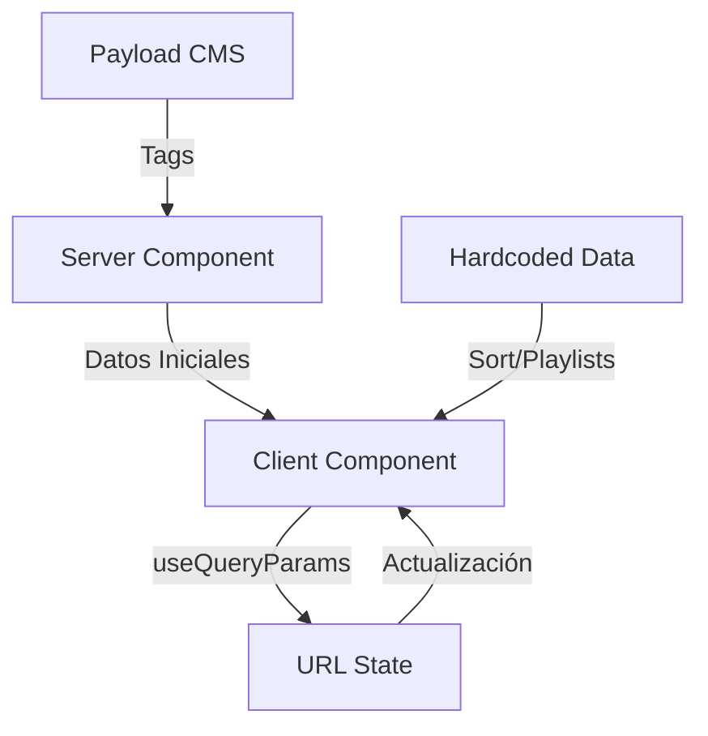

# Implementación de Parámetros de Búsqueda

## Arquitectura y Flujo de Datos

### Capas de la Aplicación

1. **Capa de Servidor (Server Layer)**
   - Responsable de obtener datos de Payload CMS
   - Maneja la lógica de negocio y transformación de datos
   - Proporciona datos iniciales a los componentes cliente

2. **Capa de Cliente (Client Layer)**
   - Maneja la interacción del usuario
   - Gestiona el estado de la URL
   - Renderiza componentes interactivos

### Flujo de Datos



### Tipos de Datos

1. **Datos Dinámicos (Server)**
   - Tags de contenido
   - Categorías
   - Otros datos de Payload CMS

2. **Datos Estáticos (Client)**
   - Opciones de ordenamiento (sort)
   - Playlists predefinidas
   - Configuraciones de UI

## Implementación Actual

### Server Components

```typescript
// Ejemplo de Server Component
export default async function Page() {
  const tags = await tagsFromContentQueryWithCache('article_web', '', ['autor', 'revisar'])
  
  return (
    <ClientComponent initialTags={tags} />
  )
}
```

### Client Components

```typescript
'use client'
export function ClientComponent({ initialTags }) {
  const { setQueryParams, getQueryParams } = useQueryParams()
  
  return (
    <SelectDropdown
      tags={initialTags}
      // ... resto de props
    />
  )
}
```

## Tareas Pendientes

### 1. Storybook Integration
- Adaptar componentes para Storybook
- Crear stories que simulen diferentes estados
- Documentar props y comportamientos

### 2. Mejoras Futuras

#### Sistema de Slugs Dinámicos
- Implementar sistema para obtener slugs de Payload CMS
- Crear colección específica para playlists de YouTube
- Migrar playlists hardcodeadas a datos dinámicos

#### Estructura Propuesta para Playlists
```typescript
interface YouTubePlaylist {
  id: string
  slug: string
  title: string
  description?: string
  thumbnailUrl?: string
  videoCount: number
}
```

### 3. Optimizaciones
- Implementar caché para datos de Payload
- Mejorar rendimiento de actualizaciones de URL
- Añadir validación de datos

## Consideraciones de Diseño

### 1. Separación de Responsabilidades
- Server: Obtención y transformación de datos
- Client: Interacción y estado de UI
- URL: Estado global de la aplicación

### 2. Tipado y Validación
- Interfaces claras entre capas
- Validación de datos en cada nivel
- Manejo de errores consistente

### 3. Mantenibilidad
- Documentación clara de flujos de datos
- Tests para cada capa
- Monitoreo de rendimiento

## Próximos Pasos

1. **Corto Plazo**
   - Integrar con Storybook
   - Completar migración de componentes
   - Implementar tests

2. **Medio Plazo**
   - Diseñar sistema de slugs dinámicos
   - Migrar playlists a Payload
   - Optimizar rendimiento

3. **Largo Plazo**
   - Sistema de caché avanzado
   - Analytics y monitoreo
   - Mejoras de UX 