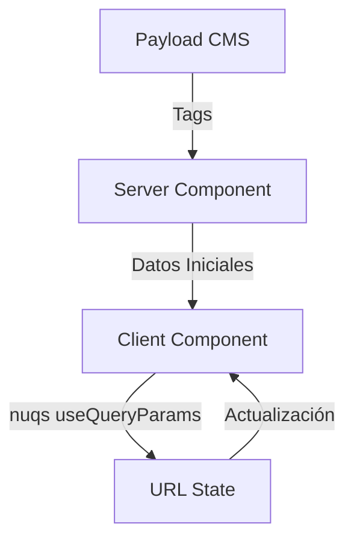

# Implementación de Parámetros de Búsqueda

## Arquitectura y Flujo de Datos

### Capas de la Aplicación

1. **Capa de Servidor (Server Layer)**
   - Responsable de obtener datos de Payload CMS
   - Maneja la lógica de negocio y transformación de datos
   - Proporciona datos iniciales a los componentes cliente

2. **Capa de Cliente (Client Layer)**
   - Maneja la interacción del usuario usando nuqs
   - Gestiona el estado de la URL
   - Renderiza componentes interactivos

### ¿Porque NUQS?

Ofrece una gestión muy funcional de los query params. Muy fácil de extraerlos y ofrece una buena integración con NextJS lo que nos evita tener que controlar un soft change (sin provocar un refresco) o un hard change (que redirije y abre de nuevo la URL).

### Flujo de Datos



### Tipos de Datos

1. **Datos Dinámicos (Server)**
   - Tags de contenido
   - Categorías
   - Otros datos de Payload CMS

2. **Datos Estáticos (Client)**
   - Opciones de ordenamiento (sort)
   - Playlists predefinidas
   - Configuraciones de UI

## Implementación Actual

### Server Components

```typescript
// Ejemplo de Server Component
export default async function Page() {
  const tags = await tagsFromContentQueryWithCache('article_web', '', ['autor', 'revisar'])
  
  return (
    <ClientComponent initialTags={tags} />
  )
}
```

### Client Components

```typescript
'use client'
export function ClientComponent({ initialTags }) {
  const { setQueryParams, getQueryParams } = useQueryParams()
  
  return (
    <SelectDropdown
      tags={initialTags}
      // ... resto de props
    />
  )
}
```

## Componentes Implementados

### 1. Filtros de Contenido
- `LecturasFilterBar`: Filtrado de artículos
- `QuotesFilterBar`: Filtrado de citas
- `VideoFilterBar`: Filtrado de videos
- `FilterBar`: Componente base para filtros

### 2. Selectores
- `BookVariantsSelector`: Selección de variantes de libros
- `SortSelectorSSR`: Ordenamiento de contenido
- `PlaylistsSelectorSSR`: Selección de playlists

### 3. Integración con Storybook
Todos los componentes han sido documentados en Storybook con:
- Estados por defecto
- Mocks de datos
- Decoradores consistentes
- Documentación clara

## Consideraciones de Diseño

### 1. Separación de Responsabilidades
- Server: Obtención y transformación de datos
- Client: Interacción y estado de UI
- URL: Estado global de la aplicación

### 2. Tipado y Validación
- Interfaces claras entre capas
- Validación de datos en cada nivel
- Manejo de errores consistente

### 3. Mantenibilidad
- Documentación clara de flujos de datos
- Tests para cada capa
- Monitoreo de rendimiento

## Beneficios de la Implementación

1. **Rendimiento Mejorado**
   - Eliminada la sobrecarga de una biblioteca externa
   - Uso directo de las APIs nativas de Next.js

2. **Mantenibilidad**
   - Código más simple y directo
   - Menos dependencias externas
   - Mejor tipado con TypeScript

3. **Consistencia**
   - Interfaz unificada para todos los componentes
   - Manejo consistente de parámetros de búsqueda

4. **Flexibilidad**
   - Mayor control sobre el comportamiento
   - Más fácil de extender y personalizar
