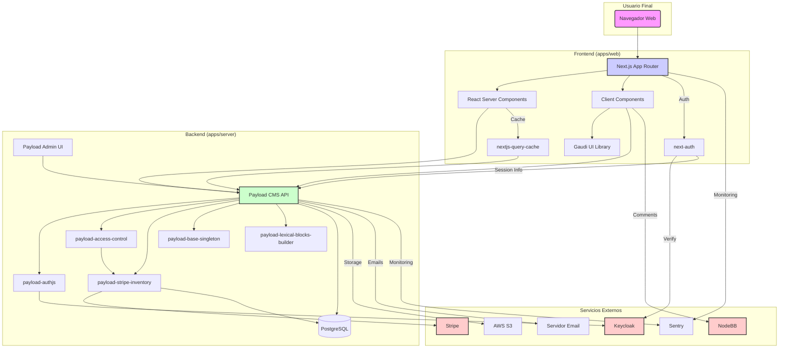

# Arquitectura del Proyecto - Escohotado Portal

## 1. Visión General

El proyecto Escohotado Portal sigue una **arquitectura de monorepo** gestionada con `pnpm workspaces` y `Turbo Repo`. Esta estructura organiza el código en dos directorios principales: `apps` y `packages`.

- **`apps/`**: Contiene las aplicaciones desplegables:
  - `server`: El backend basado en Payload CMS.
  - `web`: El frontend Next.js 15 (App Router).
- **`packages/`**: Alberga librerías internas reutilizables que encapsulan funcionalidades específicas.

Esta organización promueve la **reutilización de código**, la **separación de responsabilidades** y facilita la **consistencia** y el **mantenimiento** a través de todo el proyecto.

## 2. Componentes Principales

### 2.1. Aplicaciones (`apps/`)

- **`server` (Payload CMS)**:
  - **Rol**: Gestiona todo el contenido (artículos, libros, videos, citas), usuarios, roles, permisos y la configuración de la plataforma.
  - **Tecnologías Clave**: Payload CMS, TypeScript, Express.js, PostgreSQL (con `@payloadcms/db-postgres`).
  - **Características**: API REST/GraphQL, panel de administración personalizable, sistema de colecciones y campos flexibles, integración con autenticación (Keycloak vía `payload-authjs`).
- **`web` (Next.js)**:
  - **Rol**: Proporciona la interfaz de usuario para los visitantes y suscriptores. Consume la API del `server` para mostrar contenido y gestionar interacciones del usuario.
  - **Tecnologías Clave**: Next.js 15 (App Router), React 19, TypeScript, Tailwind CSS, `gaudi` (librería UI interna).
  - **Características**: Server Components (RSC) y Client Components, Server Actions, enrutamiento basado en App Router, integración con autenticación (Keycloak vía `next-auth`), renderizado del lado del servidor (SSR) y generación de sitios estáticos (SSG) donde sea aplicable.

### 2.2. Librerías Internas (`packages/`)

Estas librerías están diseñadas para ser independientes y reutilizables, no solo dentro de Escohotado Portal, sino potencialmente en otros proyectos futuros con necesidades similares.

- **`hegel`**: Librería base con utilidades comunes (tipos, funciones helper) usadas en todo el monorepo.
- **`payload-access-control`**: Sistema robusto para la gestión de permisos y control de acceso basado en roles y suscripciones dentro de Payload CMS. Se integra con `payload-stripe-inventory`.
- **`payload-base-singleton`**: Utilidad para asegurar una única instancia de Payload CMS compartida a través de diferentes partes del backend, crucial para operaciones consistentes.
- **`payload-lexical-blocks-builder`**: Abstracciones para construir bloques complejos y reutilizables para el editor Rich Text Lexical de Payload, facilitando la creación de contenido estructurado.
- **`payload-stripe-inventory`**: Gestiona la integración completa con Stripe, incluyendo productos, precios, suscripciones, webhooks y el portal del cliente. Es fundamental para la monetización.
- **`nextjs-query-cache`**: Sistema de caché optimizado para Next.js, probablemente para almacenar en caché respuestas de la API de Payload y mejorar el rendimiento del frontend.
- **`gaudi`**: Librería de componentes UI reutilizables para el frontend, construida con React, Tailwind CSS y posiblemente Framer Motion, asegurando consistencia visual y funcional.

## 3. Flujo de Datos y Comunicación

1.  **Gestión de Contenido**: Los administradores usan el panel de Payload CMS (`server`) para crear y gestionar contenido.
2.  **Recuperación de Contenido**: La aplicación `web` (Next.js) realiza peticiones (REST/GraphQL) a la API del `server` para obtener el contenido a mostrar. `nextjs-query-cache` puede intervenir aquí.
3.  **Autenticación**: Los usuarios se autentican a través de Keycloak, gestionado por `next-auth` en el frontend y `payload-authjs` en el backend. La sesión se comparte o verifica entre `web` y `server`.
4.  **Control de Acceso**: Cuando un usuario intenta acceder a contenido, `web` solicita la información. `server`, utilizando `payload-access-control`, verifica los permisos del usuario (basados en su rol y estado de suscripción obtenido de `payload-stripe-inventory`) antes de devolver el contenido o una indicación de acceso denegado.
5.  **Suscripciones**: El flujo de suscripción se inicia en `web`, redirige a Stripe Checkout (gestionado por `payload-stripe-inventory` en el `server`), y los webhooks de Stripe actualizan el estado de la suscripción en `server` a través de `payload-stripe-inventory`.
6.  **Comentarios**: La integración con NodeBB se realiza probablemente desde `web`, interactuando directamente con la API de NodeBB para mostrar y enviar comentarios.

## 4. Fortalezas Arquitecturales

- **Modularidad y Reutilización**: La separación en paquetes (`packages`) fomenta la creación de componentes independientes y reutilizables, reduciendo la duplicidad y facilitando futuras extensiones o nuevos proyectos.
- **Separación de Intereses (SoC)**: Clara distinción entre la gestión de contenido (backend) y la presentación (frontend).
- **Tecnologías Modernas**: Uso de Next.js 15, React 19, Payload CMS V3 y TypeScript, lo que permite aprovechar características avanzadas como Server Components, Server Actions y tipado estático fuerte.
- **Escalabilidad**: Payload CMS y Next.js están diseñados para escalar. La arquitectura de monorepo con Turbo Repo optimiza los builds y tests.
- **Mantenibilidad**: La estructura organizada y el uso de TypeScript mejoran la comprensión y el mantenimiento del código.
- **Experiencia de Desarrollo (DX)**: Herramientas como Turbo Repo, pnpm workspaces y la integración de Payload con Next.js mejoran la eficiencia del desarrollo.

## 5. Posibles Debilidades y Consideraciones

- **Complejidad del Monorepo**: Aunque potente, la gestión de un monorepo con múltiples paquetes y aplicaciones puede introducir complejidad en la configuración de builds, dependencias y CI/CD.
- **Acoplamiento Potencial**: Aunque se busca la modularidad, existe el riesgo de un acoplamiento no deseado entre los paquetes si no se definen interfaces claras.
- **Curva de Aprendizaje**: El stack tecnológico es moderno pero extenso (Payload, Next.js App Router, RSC, Stripe, Keycloak, etc.), lo que puede requerir una curva de aprendizaje para nuevos miembros del equipo.
- **Gestión de Versiones**: Mantener la compatibilidad y gestionar las versiones entre los paquetes internos y las dependencias externas requiere disciplina.
- **Rendimiento de Build/Test**: A medida que el monorepo crece, los tiempos de build y test pueden aumentar, aunque Turbo Repo ayuda a mitigar esto.

## 6. Diagrama Simplificado

_Este diagrama es una representación simplificada de las interacciones clave._
